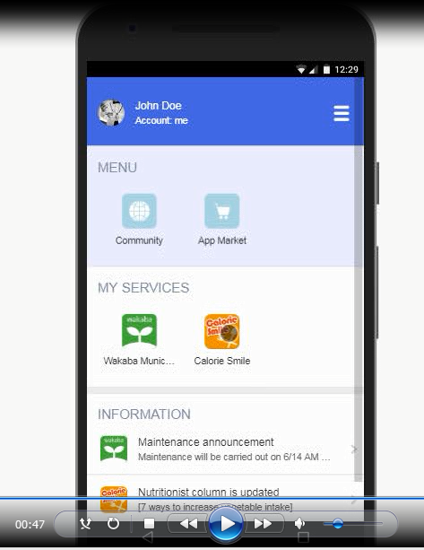

# Scenario 1 - How to synchronize scattered data  
[Video](https://www.youtube.com/watch?v=gv0p2jfn2kw) on YouTube.  

## Prerequisites for this scenario  
Optional, you don't have to mention this part when you are running out of time.    

1. Create a Pesonium account (cell) for the data subject (John Doe)  
1. Create a Calorie Smile account  
(web service that allow you to save you food diary)   
1. Install Calorie Smile App for synchronizing the photos  

## Video  
1. First, John Doe (data subject) must log on to the Personium's account from HomeApp.  
  

1. Then, tap on the Calorie Smile icon to launch the sync app.  
  

1. It will synchronized the data (photo, date of the photo taken, etc.) automatically from Calorie Smile's web service.  
  

1. Voila!!! Every thing you had on Calorie Smile's web service is now available directly in your PDS cell.  
  
