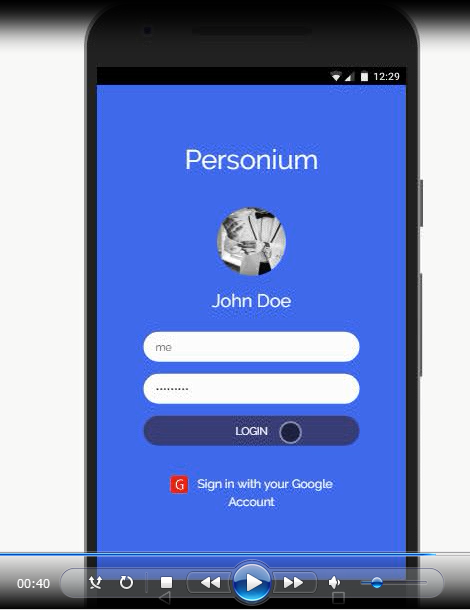
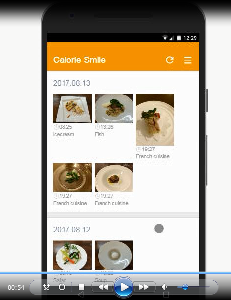

# Scenario 1 - How to synchronize scattered data  
## Prerequisites for this scenario  
Optional, you don't have to mention this part when you are running out of time.    

1. Create a Pesonium user account (cell)  
1. Create a Calorie Smile account  
(web service that allow you to save you food diary)   
1. Install Calorie Smile App for synchronizing the photos  

## Video  
1. First, log on to your Personium's account from the HomeApp.  
  

1. Second, tap on the Calorie Smile icon to launch the app.  
  

1. It will sync the data (photo, date of the photo taken, etc.) automatically.  
  

1. Every thing you uploaded to Calorie Smile's web service will be retrieved.  
